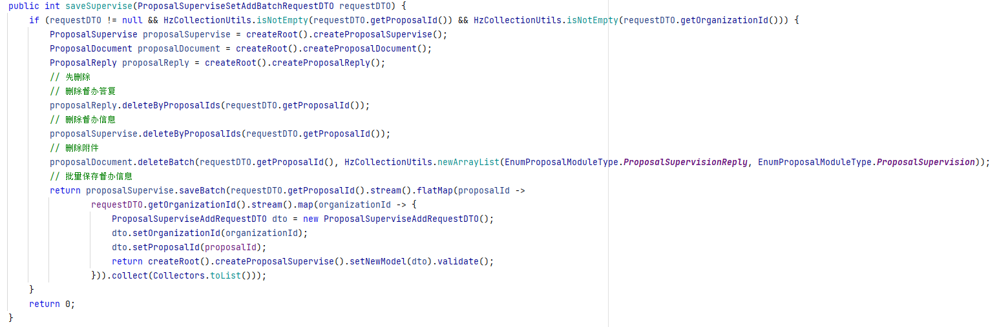

# program-optimization
**程序优化**

## 批量处理 ##
**避免循环操作数据库**
````
// 循环数据库交互
for (POJO pojo : pojoCollection) {
    crud(poji);
}
// 批量一次性交互
crudBatch(pojo);
````
**项目实例: 批量设置督办单位**  
+ 优化前  
  
+ 优化后  

## 异步处理 ##
> 某些耗时操作或者与业务无关的操作可以异步执行  
比如短信,消息的发送。日志的采集等等  
具体实现可以采用多线程或者消息队列解耦

异步的简单流程:
> 主线程A执行到某段耗时代码，交给线程B去执行，主线程继续往下执行其他代码。当线程B执行完成时，会根据业务情况决定是否返回执行结果。  
> 这里有两种情况：  
> + 主线程不关心结果，主线程可以直接返回。比如发送通知等。
> + 主线程依赖结果，拿到执行结果后进行后续操作并返回。比如比较各个平台的价格取最便宜的。  
> [AsyncDemo](src/main/java/com/boboo/AsyncDemo.java)
## 空间换时间 ##
合理地使用缓存可以大大提高接口性能，缓存就是一种空间换时间的思想。  
把要查询的数据提前放入缓存，或者把已查询出来的数据放入缓存，需要时直接查缓存，避免数据库交互或者某些计算操作

例如：redis缓存，本地缓存，memcached等。

除了缓存 还有一种常见的空间换时间场景。  
比如现在有一些用户数据和角色数据，需要对其进行赋值，最简单的方法如下：
````
List<User> userList = getUsers();
List<Role> roleList = getRoles();
for(User user : userList) {
    for(Role role : roleList) {
        if (role.getId().equals(user.getRoleId)) {
            user.setRoleName(role.getName());
        }
    }
}
````
上面的代码是最容易想到的实现方法，但是其时间复杂度是**O(n²)**
````
List<User> userList = getUsers();
List<Role> roleList = getRoles();
Map<Long, String> roleMape = roleList.stream().collect(Collectors.toMap(Role::getId, Role::getName));
for(User user : userList) {
    user.setRoleName(roleMape.get(user.getRoleId()));
}
````
将角色集合转换为Map后 原本的for循环 **O(n)** 变成map.get() **O(1)** 整个时间复杂度变成了**O(n)**
## 池化处理 ##
池化是一种对资源的预分配和重复使用的策略，避免了资源频繁创建和销毁带来的开销。  
**池**在计算机领域出现的频率也非常高， 例如数据库连接池，线程池，常量池，NAT公网地址池等等  
说到池非常容易联想到水池，水池的作用是什么？储水，拿多人取水作为例子：  
+ 单线程：排队接水，为了不浪费水，每个人都需要打开水龙头，接水，关闭水龙头。如此重复，打开和关闭水龙头可以看成创建和销毁一个线程，
接水就是这个线程的工作内容。这种方式适合人少的场景。
+ 多线程：多提供几个水龙头，适合人多的场景，比如学生宿舍公共洗漱间等。
+ 线程池：提供一个水池，把水预先放入池中，多个人同时在水池取水，水龙头不用频繁开关，支持多人并发取水，但是需要专人看管水池，用来
避免水池溢出、缺水、超员等特殊情况。这种场景适合高并发的情况。  
并发量高时不要小看开关水龙头（资源创建、销毁）带来的时间浪费（系统开销），所以池化思想最大的最用就是支持复用、避免多余的系统开销。


## 控制锁粒度 ##
在某些高并发场景下我们经常要加锁来保护共享资源，但是加锁的粒度过粗，会影响接口的性能  
什么是**锁粒度**
> 通俗来说就是你想要锁住的范围有多大  
> 打个比方你在公司上厕所只需要锁住你那一个坑位的门就可以了，不需要将整个卫生间都锁起来不让其他人进入，这一个坑位就是你的加锁粒度。

不管你用什么实现加锁，都只需要在共享临界资源加锁即可，不涉及共享资源的，就没有必要加锁。  
[LockGranularityDemo](src/main/java/com/boboo/LockGranularityDemo.java)
## 避免大事务长事务 ##
为了保证数据库的一致性，我们经常需要用到事务，在Java中使用Spring的声明式事务是非常方便的，只需要一个 **@Transactional** 注解，比如：  
````
@Transactional
public int saveUser(UserDO userDO) {
    // 省略校验或其他业务逻辑
    return userDao.save(userDO);
}
````
这里主要逻辑就是创建用户并保持入库，如果现在新增需求，创建完用户需要调用远程RPC或三方接口做推送、通知等操作，有些小伙伴可能就会这么做：  
````
@Transactional
public int saveUser(UserDO userDO) {
    // 省略校验或其他业务逻辑
    sendEmailRpc();
    notifyRpc();
    return userDao.save(userDO);
}
````
这样实现可能会有坑，事务中嵌套RPC远程调用，即事务嵌套了一些非DB操作。如果这些非DB操作耗时比较大的话，可能会出现大事务问题。  
> 所谓大事务问题就是，就是运行时间长的事务。由于事务一直不提交，就会导致数据库连接被占用，即并发场景下，数据库连接池被占满，影响到别的请求访问数据库，影响别的接口性能。

大事务引发的问题主要有：接口超时、死锁、主从延迟等等。因此，为了优化接口，我们要规避大事务问题。我们可以通过这些方案来规避大事务：  
+ RPC远程调用不要放到事务里面
+ 一些查询相关的操作，尽量放到事务之外
+ 事务中避免处理太多数据
## 程序执行顺序 ##
优化程序的逻辑，程序的代码，同样是可以节省耗时的。比如：  
你的程序创建了不必要的对象、逻辑混乱、多次数据库交互、或者不是最优算法。  
+ 有时候简单的调整下代码的逻辑顺序，就能让程序更加高效：  
> 假设某连锁加油站新增以下业务需求：如果用户是加油站会员，且首次光顾某个加油站，需要发送一条感谢短信。如果没有仔细思考，很容易写出如下代码：  
> ````
> if (isVip && isFirstTime) {
>     sendMessage();
> }
> ````
> 这段代码乍看没有什么问题，但是仔细思考以下还是需要优化的：  
> 假设有10个用户消费，其中有5个会员，有1个是外地首次进入本地加油站消费，那么isVip执行10次过滤剩下5个，isFirstTime执行5次过滤出1个。  
> 那如果执行顺序换一下呢？isFirstTime执行10次过滤剩下1个，isVip执行1次过滤剩下1个，显然是比上面的要高效一些的，如果数据量大或者条件多差距也会更明显。  
> 这其中就告诉我们应该把能过滤掉更多数据的条件放在前面优先执行，具体情况要按照实际业务情况分析。
+ 不必要的对象创建  
[UnnecessaryDemo](src/main/java/com/boboo/UnnecessaryDemo.java)

## 数据库方面 ##
**SQL优化**
+ select 具体字段代替*
+ 字段类型
+ 优化group by、order by
+ exist & in
+ join关联表数量控制
+ ......  
**索引**
+ 合理设计、使用索引
+ 索引失效
+ ......